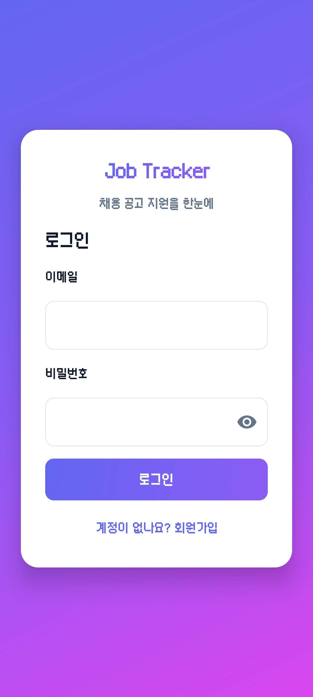
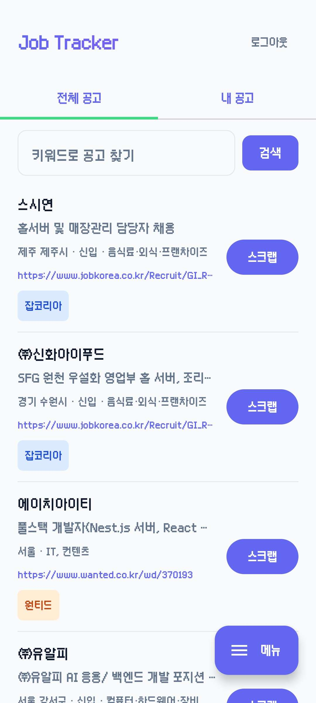
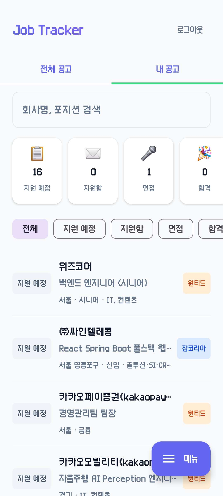
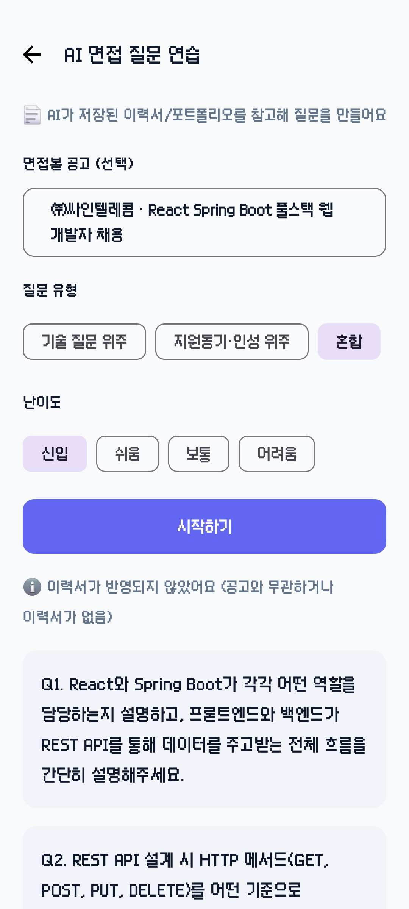
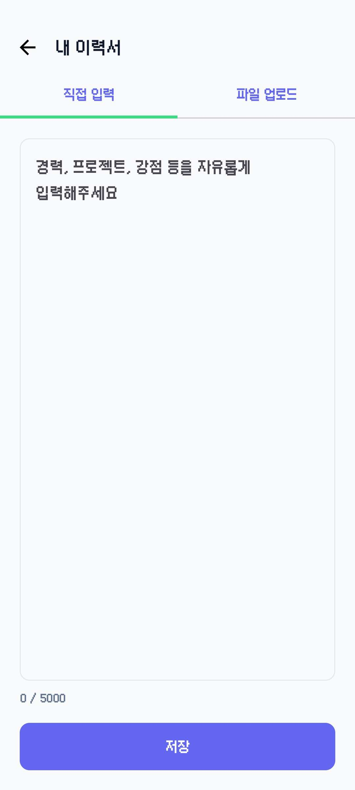
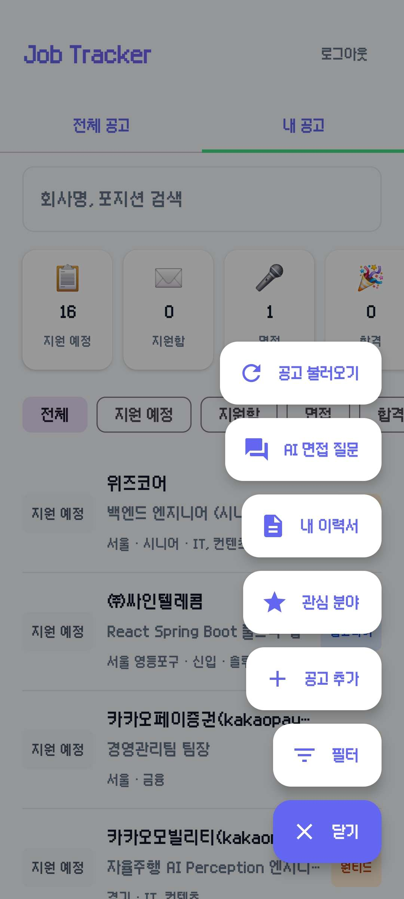

# Job Tracker Android

채용 공고 지원 현황을 한눈에 관리하는 안드로이드 앱. 취업 준비 과정에서 실제로 필요한 기능을 직접 설계하고 만들었습니다.

백엔드는 [job-tracker](https://github.com/wantfree8937/job-tracker) (Spring Boot, Render 배포) API를 사용합니다.

## 주요 기능

- **로그인 / 회원가입** — JWT 인증, DataStore 토큰 저장, 가입 후 자동 로그인
- **전체 공고 탭** (수집 공고)
  - 관심 키워드로 원티드/잡코리아 공고 불러오기 (FAB 메뉴)
  - 소스 필터 (전체 / 잡코리아 / 원티드, FAB 메뉴 [필터] 다이얼로그)
  - 검색 (키워드 프론트 즉시 필터)
  - 카드에 회사/포지션/지역·경력·업종·마감일 표시, URL 클릭 시 브라우저 이동, 스크랩
- **내 공고 탭** — 지원 상태별 통계/필터(지원 예정/지원함/면접/합격/불합격), 공고 등록/수정/삭제/상세(지역/경력/업종 포함)
- **관심 분야** — 키워드 저장 (FAB 메뉴)
- **AI 면접 질문** — 질문 유형(기술/지원동기·인성/혼합), 난이도(신입/쉬움/보통/어려움), 공고 선택(선택), 이력서 참고, 결과에 이력서 반영 여부 표시, 생성 중 이탈 방지
- **내 이력서** — 텍스트 입력(5000자) + PDF/PPT/PPTX 업로드(최대 3개), 목록/삭제, AI 면접 질문 생성 시 참고
- **FAB 확장 메뉴** — [공고 불러오기] [AI 면접 질문] [내 이력서] [관심 분야] [필터] [공고 추가]

## 기술 스택

- Kotlin 2.0.21, Jetpack Compose (Material3), AGP 8.7.3
- 클린 아키텍처 4레이어: core / data / domain / presentation
- Hilt (의존성 주입), Retrofit + OkHttp + kotlinx-serialization
- Room, DataStore, Navigation Compose
- minSdk 26 / compileSdk 36

## 프로젝트 구조

```
com.wantfree.jobtracker/
├── core/          # DI 모듈, 네비게이션
├── data/          # API, DTO, 로컬 저장소, Repository 구현
├── domain/        # Repository 인터페이스 (UI가 바라보는 계약)
└── presentation/  # Compose 화면 (로그인/홈/등록/상세/AI면접/이력서), ViewModel, 테마
```

## 화면 소개

| | |
|---|---|
|  |  |
|  |  |
|  |  |

## 백엔드

- Base URL: `https://job-tracker-so4v.onrender.com`
- API 명세: [job-tracker](https://github.com/wantfree8937/job-tracker) 저장소 참고
- Render 무료 플랜이라 15분 후 콜드 스타트 (첫 요청 최대 50초 대기)
